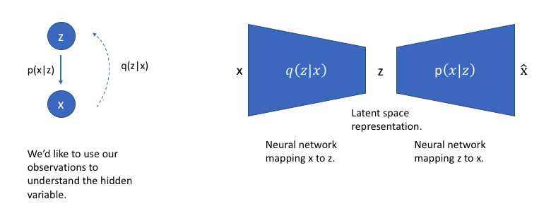

# Variational AutoEncoder
This is an implementation of Variational Autoencoders in pytorch. 
[Auto-Encoding Variational Bayes](https://arxiv.org/abs/1312.6114)
  


  <br /> VAE is a generative model - it estimates the Probability Density Function (PDF) of the training data.
  <br /> For variational autoencoders, the encoder model is referred to as the recognition model whereas the decoder model is referred to as the generative model. The encoder model learns a mapping from x to z and the decoder model learns a mapping from z back to x.

<br />  Our loss function for this network will consist of two terms, one which penalizes reconstruction error and a second term which encourages our learned distribution q(z|x) to be similar to the true prior distribution p(z), which we'll assume follows a unit Gaussian distribution.

# Usage
```bash
$ main.py --help
$ usage: 'Pytorch implementation of VAE'
[-h] [--dim_z DIM_Z] [--lr LR] [--epochs EPOCHS]
                   [--batch_size BATCH_SIZE] [--gpu GPU] [--type TYPE]
                   [--n_gpu N_GPU] [--log_interval LOG_INTERVAL]

$ optional arguments:
  -h, --help            show this help message and exit
  --dim_z DIM_Z         Dimensionality of latent variables
  --lr LR               Learning rate of ADAM optimizer
  --epochs EPOCHS       The number of epochs to run
  --batch_size BATCH_SIZE
                        Batch size
  --gpu GPU             Use GPU?
  --type TYPE           VAE, VAE_cnn
  --n_gpu N_GPU
  --log_interval LOG_INTERVAL

$ main.py  --gpu True --epochs 15 --type 'VAE'  --dim_z 10  --lr 0.001
```
